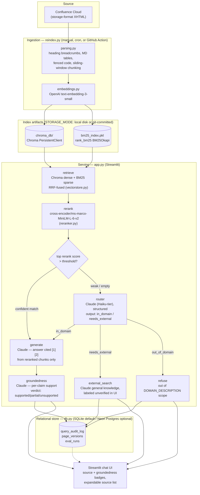
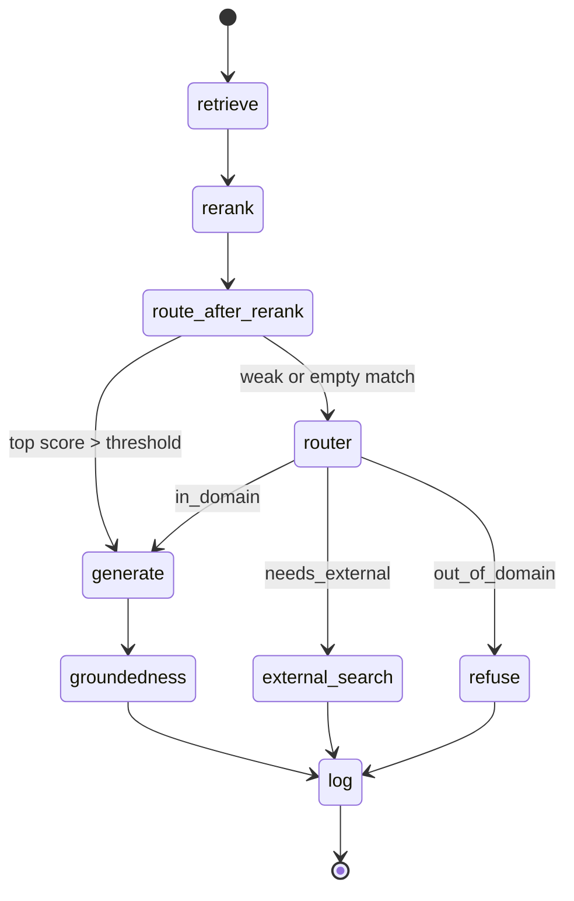

# Confluence RAG Platform

[](LICENSE)

A production-shaped Retrieval-Augmented Generation (RAG) platform over a Confluence space you author yourself. Hybrid retrieval (Chroma dense + BM25 sparse, RRF-fused) → small HuggingFace cross-encoder reranking → **retrieval-informed routing** → Claude generation → a Claude groundedness check before anything is shown as "answered from the knowledge base."

See [`production-rag-architecture.md`](production-rag-architecture.md) for the original design rationale (the "why" behind every choice below). This README documents the system as built, plus setup.

## Key features

- **Hybrid retrieval** — Chroma (dense, cosine) + `rank_bm25` (sparse), fused in application code with Reciprocal Rank Fusion. Self-hosted Chroma has no built-in hybrid search, so RRF is implemented by hand rather than assumed away.
- **Retrieval-informed routing** — retrieval runs *first*; a Claude router is only consulted as a fallback when the top reranked match is weak or empty. This avoids misrouting questions the knowledge base can actually answer (see [`graph.py`](graph.py) header for the full rationale).
- **Structured, typed decisions** — both the router and the groundedness checker use Claude's tool-use mechanism for validated JSON output, not substring matching or "ask for JSON and hope."
- **Groundedness verification** — every generated answer is checked sentence-by-sentence against its cited sources before being shown as "fully grounded." Unsupported answers are downgraded or flagged, never presented as verified when they aren't.
- **Structure-preserving ingestion** — Confluence storage-format XHTML is parsed with heading breadcrumbs, Markdown tables, and fenced code blocks intact, instead of being flattened to prose.
- **Section-aware chunking** — splits on heading boundaries first, then a token-aware sliding window within a section; tables and code fences are never split mid-block.
- **Host-agnostic by config, not by code fork** — `STORAGE_MODE` and `DATABASE_URL` are the only two knobs that change between a laptop, a VPS, Streamlit Community Cloud, or a GitHub Action.
- **Audit trail + eval history** — every query and every Ragas eval run is logged to a real relational schema (SQLite by default, Postgres/Neon optional), not a local JSON file.

## Architecture

### System overview



**Providers, explicitly:** OpenAI (embeddings only) · Claude/Anthropic (routing, generation, groundedness) · a small HuggingFace cross-encoder, self-hosted in-process (reranking) · Chroma, embedded (vectors) · `rank_bm25`, in-process (sparse retrieval) · SQLite by default, Neon Postgres optional (audit log, eval history).

Everything host-specific is a config value (`STORAGE_MODE`, `DATABASE_URL`, API keys) read once in [`config.py`](config.py) — never a code fork. The same `streamlit run app.py` works on a laptop, in a Docker container on Render/Railway/Fly.io, or on Streamlit Community Cloud.

### LangGraph state machine

The orchestrator ([`graph.py`](graph.py)) runs retrieval *before* the LLM router — a deliberate change from the original design doc. Retrieval strength is the primary routing signal; the Claude router is a fallback classifier only consulted when the top reranked match is weak or missing, because at that point the real question ("is this out of scope, or does it need live info?") is one retrieval strength alone can't answer.



## Repository layout

| File | Responsibility |
|---|---|
| [`app.py`](app.py) | Streamlit chat UI: source-type + groundedness badges, expandable sources, `st.secrets` → `os.environ` bridge for Community Cloud. |
| [`graph.py`](graph.py) | LangGraph orchestration — the state machine above. |
| [`config.py`](config.py) | Single source of truth for all settings; everything else reads `settings`, never `os.environ` directly. |
| [`confluence_client.py`](confluence_client.py) | Minimal Confluence Cloud REST client — lists pages, fetches storage-format body + version. |
| [`parsing.py`](parsing.py) | XHTML → heading-delimited sections → token-aware, section-aware chunks (tables/code never split mid-block). |
| [`embeddings.py`](embeddings.py) | OpenAI embeddings, batched (the one place OpenAI is used). |
| [`vectorstore.py`](vectorstore.py) | `HybridStore`: Chroma dense search + BM25 sparse search + hand-rolled RRF fusion. |
| [`reranker.py`](reranker.py) | Self-hosted cross-encoder reranking (`sentence-transformers`). |
| [`llm.py`](llm.py) | All Claude calls: domain router, answer generation, external-knowledge fallback, groundedness verification — each with a typed tool-use schema where structure matters. |
| [`db.py`](db.py) | SQLAlchemy models + helpers for `page_versions`, `query_audit_log`, `eval_runs`. Works unchanged against SQLite or Postgres. |
| [`reindex.py`](reindex.py) | Offline ingestion job: incremental (`version` diff) or `--full`; commits index artifacts back to git when `STORAGE_MODE=git`. |
| [`eval/run_eval.py`](eval/run_eval.py) | Ragas eval harness — runs the golden set through the live graph, scores it, records it to `eval_runs`. |
| [`eval/golden_set.jsonl`](eval/golden_set.jsonl) | Hand-authored QA pairs, including out-of-date and out-of-domain edge cases. |
| [`.github/workflows/reindex.yml`](.github/workflows/reindex.yml) | Scheduled (nightly) reindex for `STORAGE_MODE=git` hosts. |
| [`production-rag-architecture.md`](production-rag-architecture.md) | The full pre-code design doc and rationale. |

## Installation

```bash
git clone <this-repo>
cd confluence-rag-platform
pip install -r requirements.txt
cp .env.example .env
# fill in .env: OPENAI_API_KEY, ANTHROPIC_API_KEY, CONFLUENCE_* vars
```

Build the index (run this before first launching the app):

```bash
python reindex.py            # incremental: only re-embeds pages whose version changed
python reindex.py --full     # re-embeds every page regardless of version
```

## Usage

```bash
streamlit run app.py
```

Open your browser to `http://localhost:8501` to interact with the RAG UI. The same command works on a laptop, a VPS, a Docker container, or Streamlit Community Cloud.

## Configuration reference

Every setting is read once, in [`config.py`](config.py), from `os.environ` — populated by `.env` locally, `st.secrets` on Streamlit Community Cloud (bridged to `os.environ` at the top of `app.py`), repo secrets in GitHub Actions, or plain container env vars anywhere else. See [`.env.example`](.env.example) for the same list with inline comments.

| Variable | Default | Notes |
|---|---|---|
| `OPENAI_API_KEY` | — (required) | Used only for embeddings. |
| `ANTHROPIC_API_KEY` | — (required) | Used for routing, generation, groundedness. |
| `EMBEDDING_MODEL` | `text-embedding-3-small` | 1536-dim. |
| `CLAUDE_MODEL` | `claude-sonnet-4-6` | Generation + external fallback. |
| `CLAUDE_ROUTER_MODEL` | `claude-haiku-4-5-20251001` | Router + groundedness (classification-tier, not generation-tier). |
| `CONFLUENCE_BASE_URL` / `CONFLUENCE_EMAIL` / `CONFLUENCE_API_TOKEN` / `CONFLUENCE_SPACE_KEY` | — | Only needed to run `reindex.py`; the deployed app doesn't require Confluence credentials to serve queries. |
| `DOMAIN_DESCRIPTION` | `a curated knowledge base` | Feeds the router's classification prompt — change this, not code, to repoint the whole system at a different topic. |
| `STORAGE_MODE` | `local` | `local` — `reindex.py` writes directly to disk. `git` — `reindex.py` commits index artifacts back to the repo (for ephemeral-disk hosts). |
| `CHROMA_PERSIST_DIR` | `./chroma_db` | |
| `CHROMA_COLLECTION` | `kb_chunks` | |
| `BM25_INDEX_PATH` | `./bm25_index.pkl` | |
| `DATABASE_URL` | `sqlite:///./local.db` | Swap for a Neon Postgres URL to persist audit history across deployed sessions (see below). |
| `RETRIEVE_TOP_K` | `20` | Candidates pulled from each of dense/sparse before fusion. |
| `RERANK_TOP_K` | `5` | Chunks kept after cross-encoder reranking. |
| `RERANKER_MODEL` | `cross-encoder/ms-marco-MiniLM-L-6-v2` | ~22M params, CPU-friendly; deliberately not a 500M+-param reranker on a memory-constrained host. |
| `RRF_K` | `60` | Standard Reciprocal Rank Fusion constant. |
| `RERANK_RELEVANCE_THRESHOLD` | `0.0` | Cross-encoder score cutoff that decides "confident retrieval" vs. "fall through to the LLM router." Tune against your own eval set. |
| `SERPAPI_API_KEY` | — (optional) | Not currently wired into a live search call — `needs_external` questions today get Claude's general knowledge, explicitly labeled unverified. |

## Storage modes

Everything host-specific is one env var, `STORAGE_MODE`, never a code fork:

- **`local`** (default) — `reindex.py` writes directly to `./chroma_db/`. Use this anywhere with a real persistent disk: your laptop, a VPS, a Docker volume.
- **`git`** — `reindex.py` commits `chroma_db/` + `bm25_index.pkl` (and the SQLite file, if that's what `DATABASE_URL` points at — it holds `page_versions`, which is what makes incremental sync work across ephemeral runners) back to the repo after building them. Use this on ephemeral-disk hosts (Streamlit Community Cloud is the main one) — auto-redeploy on push picks up the fresh index. See [`.github/workflows/reindex.yml`](.github/workflows/reindex.yml) for the nightly scheduled version.

## Audit / eval database

Defaults to local SQLite (`DATABASE_URL=sqlite:///./local.db`) — zero setup, appropriate for a personal project where losing history on a sleep/restart is a fine trade-off. Swap `DATABASE_URL` to a Neon Postgres connection string only if you want audit history to survive across deployed sessions. Don't use Supabase for this — its free tier pauses the whole project after 7 days idle and needs a manual unpause; Neon auto-resumes on the next query with no manual step. Same SQLAlchemy code either way ([`db.py`](db.py)).

### Data model

```
page_versions(page_id PK, title, version, url, synced_at)
query_audit_log(id PK, question, router_decision, router_confidence,
                 chunk_ids[], groundedness_verdict, answer, source_type,
                 latency_ms, ts)
eval_runs(id PK, run_ts, git_sha, num_questions,
          context_precision, context_recall, faithfulness,
          answer_relevancy, raw_results)
```

Chroma collection `kb_chunks` (configurable via `CHROMA_COLLECTION`):

```
id, embedding[1536] (OpenAI text-embedding-3-small),
document: chunk content text,
metadata: { page_id, title, breadcrumb, section, url, version, chunk_index, token_count }
```

`bm25_index.pkl` — a `rank_bm25` `BM25Okapi` index over the same chunk set (tokenized content + chunk IDs), rebuilt alongside the Chroma index every time `reindex.py` runs.

## Evaluation

```bash
pip install -r eval/requirements-eval.txt
python eval/run_eval.py eval/golden_set.jsonl
```

Kept in a separate requirements file so the deployed Streamlit app doesn't carry Ragas/LangChain's weight — eval only needs to run locally or in CI.

Write your own golden set as you author Confluence pages — a couple of QA pairs per page, with real ground truth, is a much better eval-authoring workflow than reverse-engineering questions from someone else's docs. [`eval/golden_set.jsonl`](eval/golden_set.jsonl) includes two edge-case rows (an out-of-date question, an out-of-domain question) meant to be eyeballed against the printed `router=` output rather than scored as faithfulness/precision numbers — Ragas' metrics assume an in-domain, answerable question. Results are written to the `eval_runs` table so quality is tracked as a trend, not just a pass/fail on the latest commit.

## What's deliberately not built yet

- Real graph extraction/traversal (entities, relations, community summarization) — deferred as a future retrieval mode once hybrid + rerank + eval is solid and measured.
- Multi-tenant / multi-space support — single Confluence space per deployment for v1.
- A fine-tuned reranker — revisit only if eval numbers say retrieval precision is the bottleneck.
- Live/real-time indexing — nightly-refresh-via-Git is the free-tier trade-off; a real problem with that cadence is the trigger to move to an always-on host, not before.
- A wired-up `SERPAPI_API_KEY` search call for the external-fallback path — `needs_external` questions currently get Claude's general knowledge, explicitly labeled unverified in the UI and audit log.

See §7 of [`production-rag-architecture.md`](production-rag-architecture.md) for the fuller rationale and what would trigger building each of these.

## Contributing

We welcome contributions! Please fork the repository and submit a pull request.

1. **Set up** — run the installation steps above.
2. **Create a branch** — `git checkout -b my-feature`.
3. **Make changes** — ensure code follows existing style and passes tests.
4. **Run tests** — `pytest` (if tests are added).
5. **Submit PR** — describe the changes and reference any related issues.

For major changes, open an issue first to discuss the proposed design.

## License

[MIT](LICENSE)
